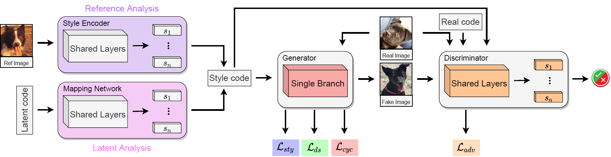

# HI2I: Hypercomplex Image-to-Image Translation
Official PyTorch repository for Hypercomplex Image-to-Image Transaltion

Eleonora Grassucci, Luigi Sigillo, Aurelio Uncini, and Danilo Comminiello

### Abstract :bookmark_tabs:

Image-to-image translation (I2I) aims at transferring the content representation from an input domain to an output one, bouncing along different target domains. Recent I2I generative models which gain outstanding results in this task comprise a set of diverse deep networks each with tens of million parameters. Moreover, images are usually three-dimensional being composed of RGB channels and common neural models do not take dimensions correlation into account, losing beneficial information. In this paper, we propose to leverage hypercomplex algebra properties to define lightweight I2I generative models capable of preserving pre-existing relations among images dimensions, thus exploiting additional input information. On manifold I2I benchmarks, we show how the proposed Quaternion StarGANv2 and parameterized hypercomplex StarGANv2 (PHStarGANv2) reduce parameters and storage memory amount while ensuring high domain translation performance and good image quality as measured by FID and LPIPS score.

### Model Architecture (from [StarGANv2](https://github.com/clovaai/stargan-v2)) :clapper:


### Results

| Model                | Params | Storage Mem | Savings            |  FID Reference    | LPIPS Reference  |  FID Latent       | LPIPS Latent     |
|----------------------|:------:|:-----------:|:------------------:|:-----------------:|:----------------:|:-----------------:|:----------------:|
| StarGANv2            |   87M  |    307MB    |         0\%        |   **21.24**       |       0.24       |       17.16       |       0.25       |
| Quaternion StarGANv2 |   22M  |     76MB    |    **75\%**        | 23.09             |       0.22       |       27.90       |       0.12       |
| PHStarGANv2 n=3      |   29M  |    137MB    |        67\%        |       28.11       |   **0.29**       | 16.63             |   **0.33**       |
| PHStarGANv2 n=4      |   22M  |     76MB    |    **75\%**        |       24.33       |        0.27      |   **16.54**       |             0.29 |

### How to run experiments :computer:

First, please install the requirements:

```pip install -r requirements.txt```

We upload a sample `config.json`, to run different experiments please edit this file, i.e:
* `datasets` can be either `afhq` and `celeba_hq`.
* `num_domains` depends on the number of domains of the chosen dataset: `3` for `afhq`, `2` for `celeba_hq`.
* `w_hpf` is set to `0` for `afhq` since it does not employ the support network, while is set to `1` for `celeba_hq`.
* `lambda_ds` is equal to `2` for `afhq` and `1` for `celeba_hq`.
* `phm=True` for PHStarGANv2, `False` for running the real-valued baseline.
* `N` is the hyperparameter for parameterized hypercomplex layers, we test `N=2,3,4`. 
* `seed=777` is to reproduce our experiments.

Then, run `python main.py`. The experiment will be directly tracked on [Weight&Biases](https://wandb.ai/).


### Cite

Please cite our work if you found it useful:

```
@article{grassucci2022HI2I,
      title={Hypercomplex Image-to-Image Translation}, 
      author={Grassucci, Eleonora and Sigillo, Luigi and Uncini, Aurelio and Comminiello, Danilo},
      year={2022},
      journal={Under review}
}
```

#### Interested in Quaternion and Hypercomplex Generative Models?

Check also: 

* Lightweight Convolutional Neural Network by Hypercomplex Parameterization, _Under Review_, 2021 [[Paper](https://arxiv.org/pdf/2110.04176.pdf)] [[GitHub](https://github.com/elegan23/hypernets)].
* Quaternion-Valued Variational Autoencoder, _ICASSP_, 2021 [[Paper](https://arxiv.org/pdf/2010.11647.pdf)] [[GitHub](https://github.com/eleGAN23/QVAE)].
* An Information-Theoretic Perspective on Proper Quaternion Variational Autoencoders, _Entropy_, 2021 [[Paper](https://www.mdpi.com/1099-4300/23/7/856)] [[GitHub](https://github.com/eleGAN23/QVAE)].
* Quaternion Generative Adversarial Networks, _Generative Adversarial Learning: Architectures and Applications, editors: Dr Roozbeh Razavi-Far, Dr Ariel Ruiz-Garcia, Professor Vasile Palade, Professor Jürgen Schmidhuber, Springer_, Jan 2022. [[Paper](https://arxiv.org/pdf/2104.09630.pdf)][[GitHub](https://github.com/eleGAN23/QGAN)].
